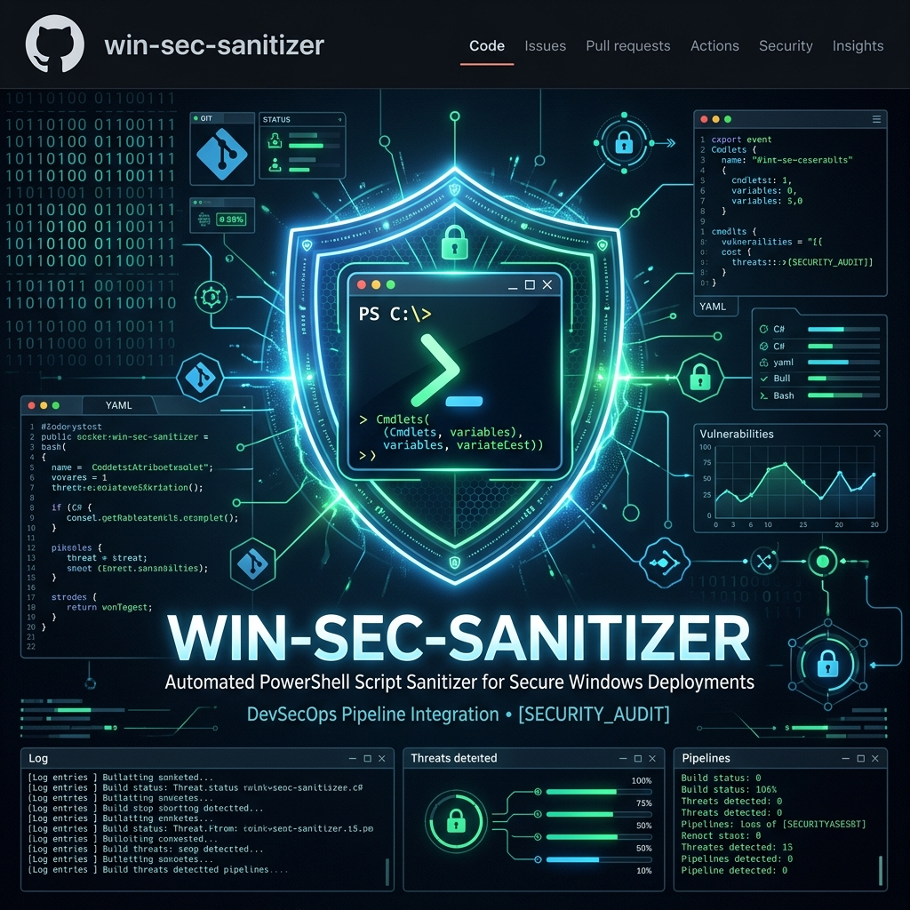
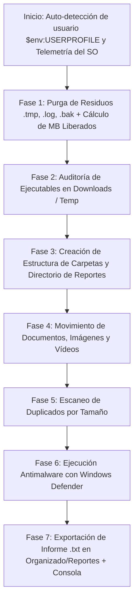

# 🛡️ win-sec-sanitizer



> **Universal PowerShell Host Hygiene & DevSecOps Automated Cleanup Tool**
> Script automatizado en PowerShell de código abierto para cualquier usuario de Windows. Realiza higienización de archivos residuales, auditoría de seguridad para ejecutables en zonas de riesgo, ordenación inteligente de archivos, análisis antimalware proactivo y **generación automática de informes de auditoría detallados (`.txt` y consola)**.

[](https://docs.microsoft.com/powershell/)
[](https://microsoft.com)
[](#-informe-detallado-y-auditor%C3%ADa-txt--consola)

---

## ⚡ Ejecución Rápida (One-Liner / Copiar y Pegar)

No necesitas modificar rutas ni configurar nada. El script **detecta automáticamente** el usuario actual de Windows (`$env:USERPROFILE`).

Abre **PowerShell** (de preferencia como Administrador) y ejecuta:

```powershell
# Opción 1: Ejecutar directamente descargando desde el repositorio
irm https://raw.githubusercontent.com/DavidCevallos15/win-sec-sanitizer/main/win-sec-sanitizer.ps1 | iex
```

O si ya clonaste/descargaste el repositorio:

```powershell
# Opción 2: Ejecución local automática sin parámetros
.\win-sec-sanitizer.ps1
```

---

## 📋 Tabla de Contenidos
- [⚡ Ejecución Rápida](#-ejecución-rápida-one-liner--copiar-y-pegar)
- [📖 Guía Completa de Ejecución Paso a Paso](#-guía-completa-de-ejecución-paso-a-paso)
- [💡 Recomendaciones Antes, Durante y Después de Ejecutar](#-recomendaciones-antes-durante-y-después-de-ejecutar)
- [🎯 ¿Qué hace y para qué sirve?](#-qué-hace-y-para-qué-sirve)
- [📊 Informe Detallado y Auditoría (.txt + Consola)](#-informe-detallado-y-auditoría-txt--consola)
- [⚙️ Arquitectura del Flujo](#-arquitectura-del-flujo)
- [🔍 Funciones del Script (`win-sec-sanitizer.ps1`)](#-funciones-del-script-win-sec-sanitizerps1)
- [🛡️ Por qué es DevSecOps](#-por-qué-es-devsecops)
- [💻 Compatibilidad y Requisitos](#-compatibilidad-y-requisitos)
- [📤 Pasos para Subir a GitHub](#-pasos-para-subir-a-github)
- [🍌 Prompt para Nano Banana (Portada / Banner IA)](#-prompt-para-nano-banana-portada--banner-ia)

---

## 📖 Guía Completa de Ejecución Paso a Paso

Sigue estas sencillas instrucciones para ejecutar el script de forma segura en cualquier equipo Windows:

### Paso 1: Abrir PowerShell como Administrador
1. Presiona la tecla `Windows` o haz clic en el menú Inicio.
2. Escribe `PowerShell`.
3. Haz clic derecho sobre **Windows PowerShell** (o PowerShell 7) y selecciona **"Ejecutar como administrador"**.
*(Esto es necesario para permitir que Windows Defender ejecute el análisis completo de seguridad)*.

### Paso 2: Habilitar la Política de Ejecución de Scripts
Por defecto, Windows puede bloquear la ejecución de scripts no firmados. Ejecuta el siguiente comando para permitirlo únicamente en tu sesión actual:
```powershell
Set-ExecutionPolicy Bypass -Scope Process -Force
```

### Paso 3: Navegar a la Carpeta del Script y Ejecutar
Navega hasta el directorio donde descargaste el script y ejecútalo:
```powershell
cd C:\Ruta\A\Tu\Carpeta
.\win-sec-sanitizer.ps1
```

> 💡 **Parámetro Personalizado (Opcional):** Si deseas analizar una carpeta específica que no sea tu perfil de usuario, pásala como argumento:
> ```powershell
> .\win-sec-sanitizer.ps1 -TargetDirectory "D:\MiCarpetaPersonalizada"
> ```

---

## 💡 Recomendaciones Antes, Durante y Después de Ejecutar

### 🛑 Antes de la Ejecución (Preparación):
- **Cierra archivos abiertos en edición:** Si tienes documentos Word, Excel o imágenes abiertas en la raíz de tu carpeta de usuario, ciérralos para permitir que el script pueda moverlos u organizarlos sin bloqueos.
- **Verifica permisos de Administrador:** Si no ejecutas la terminal como Administrador, el script funcionará normalmente organizando y limpiando, pero la Fase 6 (escaneo de Windows Defender) emitirá un aviso y se omitirá.

### ⏳ Durante la Ejecución (En Proceso):
- **No cierres la consola de PowerShell:** Al llegar a la Fase 6, el script solicitará a Windows Defender realizar un `FullScan`. Este proceso se ejecuta en segundo plano a través del motor del sistema y puede tardar unos minutos según el tamaño de tu disco.
- **Observa las Alertas en Color ROJO:** Si en la **Fase 2** ves líneas rojas etiquetadas como `[ALERTA DE SEGURIDAD]`, toma nota mental o espera al reporte final. Significa que hay ejecutables (`.exe`, `.bat`, `.ps1`) en tus carpetas de `Descargas` o `Temp`.

### 📄 Después de la Ejecución (Revisión):
- **Revisa el informe `.txt` de auditoría:** Ve a la carpeta creada `Organizado\Reportes\` y abre el archivo `sec-sanitizer-report_AAAAMMDD_HHMMSS.txt` para consultar el desglose exacto del espacio liberado y las métricas.
- **Inspecciona la carpeta `Organizado`:** Confirma que tus documentos (`.pdf`, `.docx`), imágenes (`.png`, `.jpg`) y vídeos (`.mp4`) se hayan movido correctamente a sus subcarpetas correspondientes.
- **Verifica los Duplicados:** Si el informe lista grupos de archivos duplicados, puedes revisar las rutas indicadas para decidir si deseas conservar solo una copia y liberar espacio adicional.

---

## 🎯 ¿Qué hace y para qué sirve?

**`win-sec-sanitizer`** es una herramienta de mantenimiento y seguridad pensada para cualquier usuario o administrador de sistemas en Windows.

### Principales Beneficios:
1. **Zero-Configuration:** Funciona *out-of-the-box* en cualquier computadora Windows sin necesidad de editar rutas manuales.
2. **Purga Residual Segura:** Elimina automáticamente logs (`.log`), archivos temporales (`.tmp`) y backups obsoletos (`.bak`, `.old`), calculando el espacio exacto liberado en MB.
3. **Auditoría de Seguridad de Amenazas:** Detecta ejecutables y scripts (`.exe`, `.bat`, `.cmd`, `.ps1`, `.vbs`) alojados en ubicaciones propensas a infección (`Downloads`, `Temp`).
4. **Organización Inteligente:** Clasifica archivos sueltos en carpetas (`Documentos`, `Imagenes`, `Videos`).
5. **Detección de Duplicados:** Encuentra archivos idénticos en disco comparando sus tamaños exactos.
6. **Integración con Windows Defender:** Desencadena un escaneo de seguridad nativo (`Start-MpScan -ScanType FullScan`).
7. **Informe Auditables Persistente:** Genera un archivo **`.txt`** con marca de tiempo en `Organizado\Reportes\sec-sanitizer-report_YYYYMMDD_HHMMSS.txt`.

---

## 📊 Informe Detallado y Auditoría (.txt + Consola)

💡 **Recomendación DevSecOps:** El script combina **retroalimentación inmediata en consola** con la creación de un **informe persistente `.txt`** para registro y auditoría.

El informe `.txt` se guarda automáticamente en:
`Organizado\Reportes\sec-sanitizer-report_AAAAMMDD_HHMMSS.txt`

### 📄 Ejemplo del Informe Generado (`.txt`):

```text
================================================================================
            WIN-SEC-SANITIZER - INFORME DETALLADO DE HIGIENIZACION
================================================================================

1. INFORMACION GENERAL DEL SISTEMA Y EJECUCION
--------------------------------------------------------------------------------
Fecha y Hora de Inicio: 2026-07-29 18:35:00
Tiempo de Procesamiento: 00m:04s
Nombre de la Computadora: WORKSTATION-PC
Usuario Activo:         David
Sistema Operativo:     Microsoft Windows 11 Pro (64-bit)
Version del SO:         10.0.22631
Memoria RAM Total:      16.0 GB
Memoria RAM Libre:      8.45 GB
Directorio Escaneado:   C:\Users\David

2. RESUMEN DE METRICAS Y OPTIMIZACION
--------------------------------------------------------------------------------
Archivos Basura Eliminados:     14
Espacio Recuperado en Disco:    128.45 MB
Alertas de Seguridad:          2
Archivos Organizados (Docs):   8
Archivos Organizados (Fotos):  15
Archivos Organizados (Videos): 3
Grupos Duplicados Hallados:    2
Espacio Redundante Estimado:   45.2 MB
Estado de Antivirus (Defender): FullScan de Windows Defender ejecutado correctamente

3. DETALLE DE ARCHIVOS ELIMINADOS (LIMPIEZA DE RESIDUOS)
--------------------------------------------------------------------------------
- C:\Users\David\AppData\Local\Temp\cache_old.tmp (12.4 KB)
- C:\Users\David\Downloads\setup_backup.bak (116.05 MB)

4. AUDITORIA DE SEGURIDAD (EJECUTABLES EN CARPETAS DE RIESGO)
--------------------------------------------------------------------------------
[RIESGO] C:\Users\David\Downloads\script_desconocido.ps1 (Extension: .ps1)
[RIESGO] C:\Users\David\Downloads\unverified_installer.exe (Extension: .exe)

5. DETALLE DE ARCHIVOS DUPLICADOS ENCONTRADOS
--------------------------------------------------------------------------------
Tamaño: 22.6 MB (Archivos: 2)
      - C:\Users\David\Documents\video_demo.mp4
      - C:\Users\David\Downloads\video_demo_copy.mp4

================================================================================
                        FIN DEL INFORME AUDITABLE
================================================================================
```

---

## ⚙️ Arquitectura del Flujo



---

## 🔍 Funciones del Script (`win-sec-sanitizer.ps1`)

### 1. Auto-detección Dinámica de Directorio
```powershell
param (
    [string]$TargetDirectory = $env:USERPROFILE,
    [bool]$ExportReport = $true
)
```
- Detecta automáticamente el perfil del usuario activo (ej: `C:\Users\Juan`, `C:\Users\Maria`, etc.) sin que nadie tenga que alterar el código.

### 2. Eliminación Resiliente de Basura y Recopilación de Métricas
```powershell
$JunkExtensions = @("*.tmp", "*.log", "*.bak", "*.old")
$JunkFiles = Get-ChildItem -Path $TargetDirectory -Recurse -Include $JunkExtensions -ErrorAction SilentlyContinue
```
- Implementa manejo robusto de excepciones (`try/catch`) y calcula el peso exacto eliminado.

---

## 🛡️ Por qué es DevSecOps

**DevSecOps** integra la seguridad y la trazabilidad en la automatización operativa:

- **Ops (Operaciones):** Mantenimiento continuo del almacenamiento y eliminación de residuos.
- **Sec (Seguridad y Auditoría):** Registro auditables en archivo `.txt`, inspección de scripts/ejecutables en carpetas no confiables y escaneo mediante antivirus nativo.
- **Dev (Desarrollo Limpio):** Código modular en PowerShell estructurado bajo principios **SOLID** y **DRY**.

---

## 💻 Compatibilidad y Requisitos

- **SO:** Windows 10, Windows 11, Windows Server 2016+
- **PowerShell:** 5.1 / 7+
- **Permisos:** Se recomienda ejecutar PowerShell como **Administrador** para habilitar la Fase 6 (Windows Defender Full Scan).

*Herramienta desarrollada bajo principios de Clean Code, DevSecOps y Código Abierto.*
